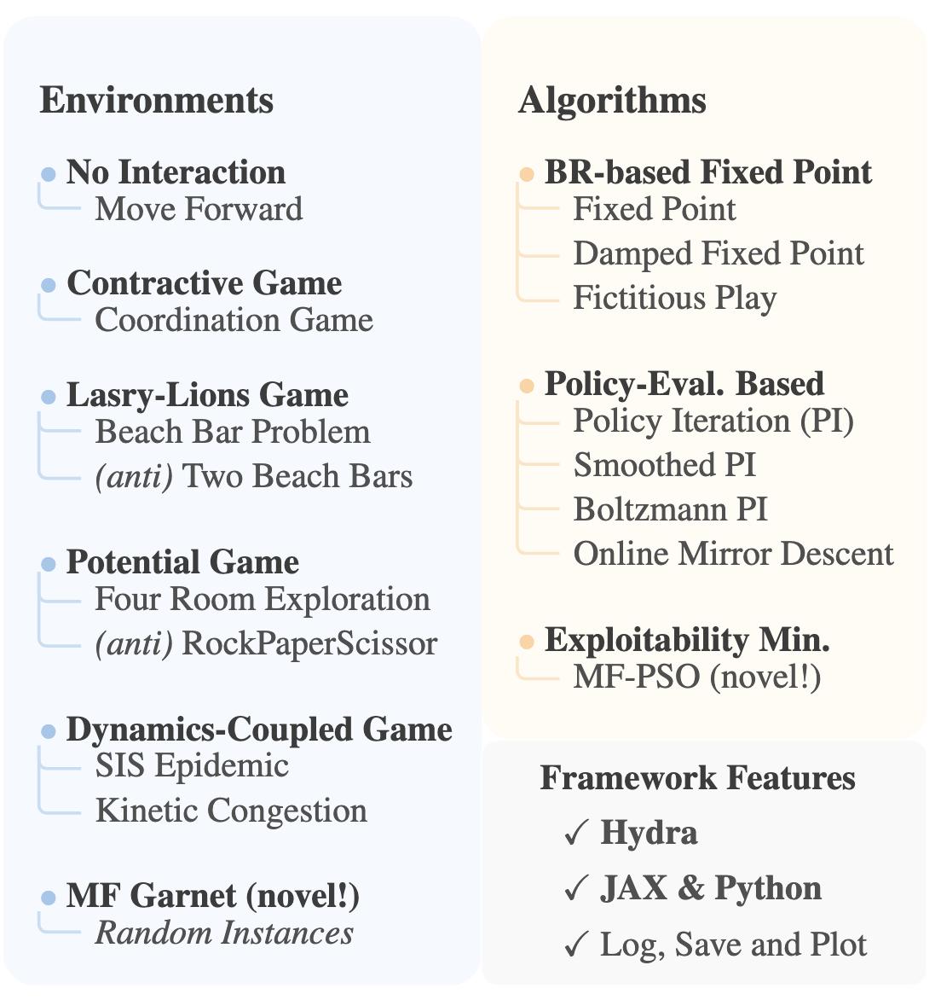

# Bench-MFG


Benchmark methods for Mean Field Games (MFG).



## Easy Start

```bash
# Setup environment
uv venv --python 3.11
source .venv/bin/activate
uv pip install -e .
```
### Run experiment
Modify the `config/defaults.yaml` selecting algorithm and environment. Then run:
```bash
python main.py
```

## Running Experiments
See [EXPERIMENTS.md](EXPERIMENTS.md) for detailed instructions on how to run experiments in batch.

### Configuration

Edit configuration files in `conf/`:
- `conf/defaults.yaml`: Main configuration
- `conf/algorithm/`: Algorithm-specific settings
- `conf/environment/`: Environment configurations
- `conf/logging/logging.yaml`: WandB logging settings

## Repository Structure

```
Bench-MFG/
├── conf/                    # Configuration files (Hydra)
│   ├── defaults.yaml        # Main configuration
│   ├── algorithm/           # Algorithm configs (pso, omd, pi, etc.)
│   ├── environment/         # Environment configs
│   ├── experiment/          # Experiment settings
│   ├── logging/             # Logging configuration
│   └── visualization/       # Plotting settings
├── envs/                    # MFG environments
│   ├── mf_garnet/          # MF Garnet (novel)
│   ├── four_rooms_obstacles/
│   ├── lasry_lions_chain/
│   ├── contraction_game/
│   ├── kinetic_congestion/
│   ├── sis_epidemic/
│   └── ...                  # Other environments
├── learner/                 # Algorithm implementations
│   ├── jax/                 # JAX implementations
│   └── python/              # Python implementations
├── utility/                 # Utilities
│   ├── create_environment.py
│   ├── create_solver.py
│   ├── run_training.py
│   ├── save_results.py
│   ├── wandb_logger.py
│   └── MFGPlots.py
├── outputs/                 # Experiment results
├── scripts/                 # Shell scripts
├── main.py                  # Entry point
└── pyproject.toml           # Project dependencies
```

## Outputs

Results are saved to `outputs/YYYY-MM-DD/EnvironmentName/AlgorithmName/ExperimentName/`:
- `*_results.npz`: Numerical results (policy, mean field, exploitabilities)
- `mfg_experiment.log`: Execution logs
