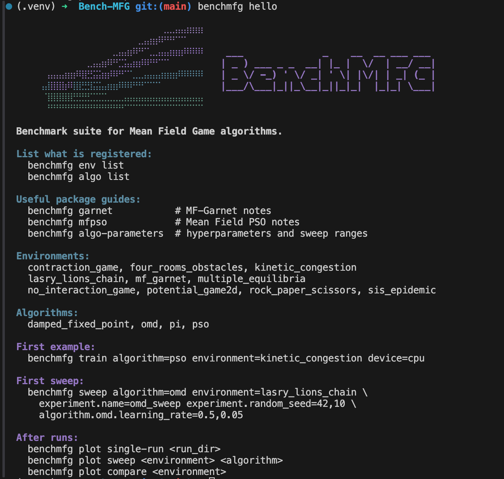

<div align="center">


# BenchMFG

Benchmark suite for Mean Field Game algorithms.

[](https://www.python.org/downloads/)
[](https://github.com/google/jax)
[](https://hydra.cc)
[](https://github.com/astral-sh/uv)

[](https://opensource.org/licenses/MIT)
[](https://docs.pytest.org/)
[](https://github.com/astral-sh/ruff)
[](https://pre-commit.com/)

</div>

> [!NOTE]
> ⚠️🔧 We are continuously improving BenchMFG. For any issues, problems, the need to add new env or algorithms, feel free to contact me at lm2183@cam.ac.uk or open an issue. We are quite responsive!

> [!NOTE]
> BenchMFG2 (RL, continuous control, partially observability) is in production...


## Contents

- [Install](#install)
- [Quick Start](#quick-start)
- [Registered Configs: envs and algos](#registered-configs)
- [Sweep](#sweep)
- [Python API](#python-api)
- [Outputs And Plots](#outputs-and-plots)
- [Extending BenchMFG: create new envs and algos](docs/EXTENDING.md)
- [MF-Garnet: scaling laws and robustness](docs/MFG_GARNET.md)

## Install

```bash
uv add bench-mfg-suite
# or
pip install bench-mfg-suite
```

For local development:

```bash
uv sync --extra dev
```

CUDA is optional (but if we are running on gpu make sure you download that!!!!). The default install uses CPU-compatible JAX.

```bash
# Linux/NVIDIA, pip-managed CUDA runtime components:
uv add "bench-mfg-suite[cuda12]"
pip install "bench-mfg-suite[cuda12]"

# Linux/NVIDIA, local CUDA installation:
pip install "bench-mfg-suite[cuda12-local]"
```

If GPU initialization fails, check `nvidia-smi` and the official JAX install matrix:
https://docs.jax.dev/en/latest/installation.html

## Quick Start ⚡️

👑 Quick understanding of the repository and the package run the following commands

```bash
benchmfg hello
benchmfg garnet
benchmfg mfpso
benchmfg algo-parameters
```



List registered configs:

```bash
benchmfg env list
benchmfg algo list
```

💥 Run one quick experiment on your machine:

```bash
benchmfg train algorithm=omd environment=four_rooms_obstacles device=cpu
```

## Registered Configs

**Environments**:
`contraction_game`, `four_rooms_obstacles`, `kinetic_congestion`, `lasry_lions_chain`, `mf_garnet`, `multiple_equilibria`, `no_interaction_game`, `potential_game2d`, `rock_paper_scissors`, `sis_epidemic`.

**Algorithms**:
`damped_fixed_point`, `omd`, `pi`, `pso`.

Use `benchmfg env list` and `benchmfg algo list` for the installed package’s authoritative list.

Use `benchmfg algo-parameters` (or `make algo-parameters`) to print every algorithm’s hyperparameters, defaults, recommended sweep ranges, and the exact override syntax.

## Sweep

Run a sweep:

```bash
benchmfg sweep \
  algorithm=omd \
  environment=lasry_lions_chain \
  experiment.name=omd_sweep \
  experiment.random_seed=42,10,111,1032 \
  algorithm.omd.learning_rate=0.5,0.05,0.005 \
  algorithm.omd.temperature=0.2,0.5,0.8
```

## Python API

```python
import benchmfg

cfg = benchmfg.load_config(["algorithm=omd", "environment=lasry_lions_chain"])
environment, initial_policy = benchmfg.make_environment(cfg)
solver = benchmfg.make_solver(
    cfg,
    environment=environment,
    initial_policy=initial_policy,
)

fixed_mf_env = benchmfg.make_fixed_mean_field_env(
    environment,
    environment.stationary_mean_field,
)
```

## Outputs And Plots

Runs write artifacts under:

```text
outputs/<Env>/<Algorithm>/seed_<seed>/<Experiment>/<run_id>/
```

Important files: `exploitabilities.npz`, `final_mean_field.npz`, `final_policy.npz`,
`metrics.npz`, `config.yaml`.

Plot commands:

```bash
benchmfg plot single-run <run_dir>
benchmfg plot sweep <environment> <algorithm>
benchmfg plot compare <environment>
```

Plot discovery defaults:

- `single-run <run_dir>` plots exactly that timestamped run.
- `sweep <environment> <algorithm>` scans `outputs/` by default. For each seed and
  hyperparameter version, it selects the latest timestamped run containing
  `exploitabilities.npz`.
- `compare <environment>` reads the `results/<environment>/<algorithm>/best_model.yaml`
  files written by `plot sweep`; rerun `plot sweep` first if new runs were added.
- Use `--outputs-dir <path>` on sweep/compare commands when artifacts are not under
  `outputs/`.

## Repository Layout

```text
src/benchmfg/
├── config/      # packaged Hydra configs
├── envs/        # MFG environments
├── learner/     # solvers
├── utility/     # training, saving, plotting helpers
├── cli.py       # benchmfg command
└── train.py     # Hydra train entrypoint
```

See [EXPERIMENTS.md](EXPERIMENTS.md) for batch-run scripts.
